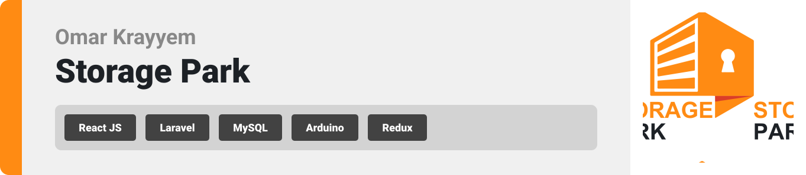
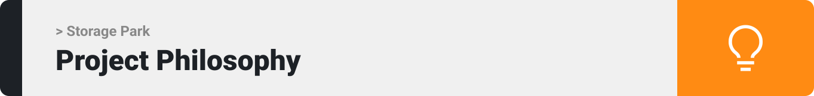

> Storage Park is a system for a warehouse includes a powerful warehouse management system that offers businesses complete control and enhanced visibility into their warehouse operations. One of the key functionalities of a WMS is its capability to incorporate location tracking technologies, such as GPS, to precisely monitor the whereabouts of orders and inventory items within the warehouse.
>
> In addition to its robust warehouse management features, Storage Park incorporates a customer-centric live order tracking system. This feature allows businesses to provide real-time updates and status information to their customers, ensuring a seamless and transparent order fulfillment process.

### User Types 
1. Admin
2. Worker
3. Partner
4. customer

### Features of the App 

As a Admin: 

- I want to access a comprehensive dashboard, so I can view and manage all aspects of the coffee shop's app and operations.
- I want to manage user accounts and access, including adding and removing employees and partners, to ensure security and compliance.
- I want to view analytics and reports on sales, customer behavior, and inventory levels, so I can make informed business decisions.
  
As a Worker: 

- I want to receive new delivery orders, so I can prepare and deliver them promptly.
- I want to have a clear list of delivery addresses and customer contact information, so I can efficiently deliver orders.
- I want to update the order status (picked up, on the way, delivered) in real-time, so customers and admin can track the progress.

As a Partner: 

- I want to log in to my account, so I can access my store's inventory and order history.
- I want to place new orders for products and manage their quantities, so I can keep my store well-stocked.
- I want to receive when my order is ready for pickup or delivery, so I can plan accordingly.
  
As a Customer: 

- I want to see real-time updates on the status of my order.

  

Open [http://localhost:3000](http://localhost:3000) to view it in your browser.

The page will reload when you make changes.\
You may also see any lint errors in the console.

### `npm test`

Launches the test runner in the interactive watch mode.\
See the section about [running tests](https://facebook.github.io/create-react-app/docs/running-tests) for more information.

### `npm run build`

Builds the app for production to the `build` folder.\
It correctly bundles React in production mode and optimizes the build for the best performance.

The build is minified and the filenames include the hashes.\
Your app is ready to be deployed!

See the section about [deployment](https://facebook.github.io/create-react-app/docs/deployment) for more information.

### `npm run eject`

**Note: this is a one-way operation. Once you `eject`, you can't go back!**

If you aren't satisfied with the build tool and configuration choices, you can `eject` at any time. This command will remove the single build dependency from your project.

Instead, it will copy all the configuration files and the transitive dependencies (webpack, Babel, ESLint, etc) right into your project so you have full control over them. All of the commands except `eject` will still work, but they will point to the copied scripts so you can tweak them. At this point you're on your own.

You don't have to ever use `eject`. The curated feature set is suitable for small and middle deployments, and you shouldn't feel obligated to use this feature. However we understand that this tool wouldn't be useful if you couldn't customize it when you are ready for it.

## Learn More

You can learn more in the [Create React App documentation](https://facebook.github.io/create-react-app/docs/getting-started).

To learn React, check out the [React documentation](https://reactjs.org/).

### Code Splitting

This section has moved here: [https://facebook.github.io/create-react-app/docs/code-splitting](https://facebook.github.io/create-react-app/docs/code-splitting)

### Analyzing the Bundle Size

This section has moved here: [https://facebook.github.io/create-react-app/docs/analyzing-the-bundle-size](https://facebook.github.io/create-react-app/docs/analyzing-the-bundle-size)

### Making a Progressive Web App

This section has moved here: [https://facebook.github.io/create-react-app/docs/making-a-progressive-web-app](https://facebook.github.io/create-react-app/docs/making-a-progressive-web-app)

### Advanced Configuration

This section has moved here: [https://facebook.github.io/create-react-app/docs/advanced-configuration](https://facebook.github.io/create-react-app/docs/advanced-configuration)

### Deployment

This section has moved here: [https://facebook.github.io/create-react-app/docs/deployment](https://facebook.github.io/create-react-app/docs/deployment)

### `npm run build` fails to minify

This section has moved here: [https://facebook.github.io/create-react-app/docs/troubleshooting#npm-run-build-fails-to-minify](https://facebook.github.io/create-react-app/docs/troubleshooting#npm-run-build-fails-to-minify)
