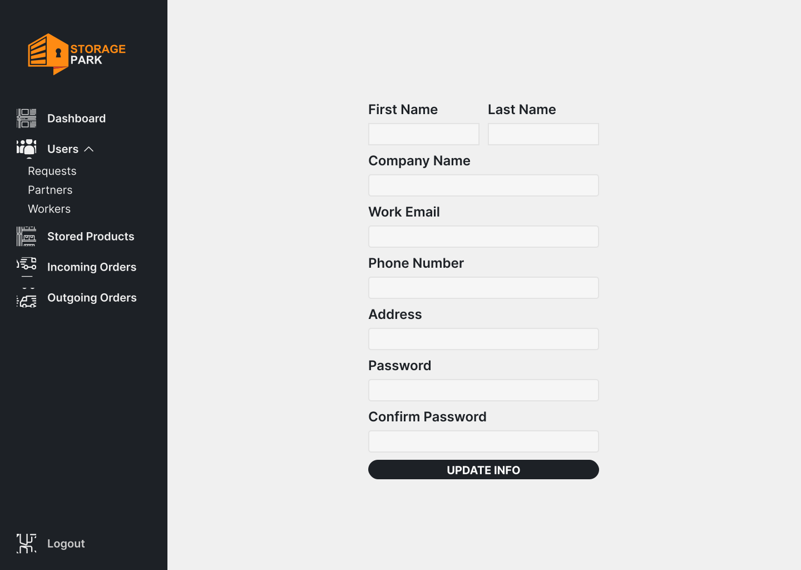
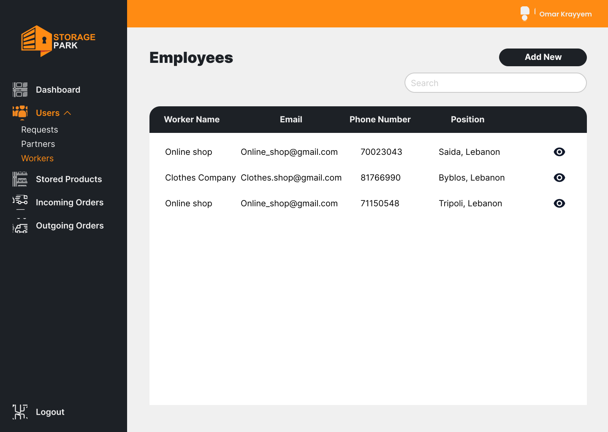

<br><br>

<br><br>

<br><br>
- [Project Description](#project-description)
- [User Types](#user-types)
- [User Stories](#User-Stories)
- [Tech Stack](#Tech-stack)
- [Prototyping](#prototyping)
- [Demo](#Demo)
- [Backend](#Backend)
- [Performance](#Performance)
- [How to Run](#How-to-run)
 
  
<br><br>

<br><br>

<a name="project-description"></a>
> Storage Park is a system for a warehouse includes a powerful warehouse management system that offers businesses complete control and enhanced visibility into their warehouse operations. One of the key functionalities of a WMS is its capability to incorporate location tracking technologies, such as GPS, to precisely monitor the whereabouts of orders and inventory items within the warehouse.
>
> In addition to its robust warehouse management features, Storage Park incorporates a customer-centric live order tracking system. This feature allows businesses to provide real-time updates and status information to their customers, ensuring a seamless and transparent order fulfillment process.

### User Types 
1. Admin
2. Worker
3. Partner
4. Customer

### User Stories

As an Admin: 

- I want to access a comprehensive dashboard, so I can view and manage all aspects of the coffee shop's app and operations.
- I want to manage user accounts and access, including adding and removing employees and partners, to ensure security and compliance.
- I want to view analytics and reports on sales, customer behavior, and inventory levels, so I can make informed business decisions.
  
As a Worker: 

- I want to receive new delivery orders, so I can prepare and deliver them promptly.
- I want to have a clear list of delivery addresses and customer contact information, so I can efficiently deliver orders.
- I want to update the order status (picked up, on the way, delivered) in real-time, so customers and admin can track the progress.

As a Partner: 

- I want to log in to my account, so I can access my store's inventory and order history.
- I want to place new orders for products and manage their quantities, so I can keep my store well-stocked.
- I want to be notified when my order is ready for pickup or delivery.
  
As a Customer: 

- I want to see real-time updates on the status of my order.

<br><br>

<br><br>

### Mockups 

>We designed Fatal Breath using wireframes and mockups, iterating on the design until we reached the ideal layout for easy navigation and a seamless user experience.

| Landing Page  | Login | Signup |
| ---| ---| ---|
|  |  |  |
| Dashboard | Requests | Requests Form |
|  |  |  |
| Profile | Partners | Partners Form |
|  |  |  |
| Workers | Workers Form | Stored Items |
|  |  |  |
| Stored Items Form | Incoming Orders | Incoming Order Details |
|  |  |  |
| Outgoing Orders | Incoming Order Details |
|  |  |


<br><br>

<br><br>

### Tech-stack 
###  Storage Park is built using the following technologies:

- This project uses the [React Library](https://react.dev/) for the frontend development.
- This project uses [Laravel](https://laravel.com/), a PHP web application framework. Laravel simplifies web development by providing robust tools and an expressive syntax for building secure and scalable web applications.
- [MySQL](https://www.mysql.com/) for the database. It is an open-source relational database management system.
- Storage Park includes hardware integration with an ESP8266 microchip connected to a GPS sensor to get location.

<br><br>

<br><br>

### Demo
Using the wireframes and mockups as a guide, we implemented the Storage Park app with the following features:

| Landing Page  | Tracking Order | Login |
| ---| ---| ---|
|  |  |  |
| Registration | View Stock | Add New Order |
|  |  |  |
| Change Password |
|  |
<br><br>


<br><br>
### Backend
[Backend Repository](https://github.com/Omar-Krayyem/storage_park_server.git)
<br><br>
<a name="Performance" ></a>
 
> The following tests were conducted in Postman to assess the functionality of my application's primary APIs
<br><br>

URL: http://127.0.0.1:8000/api/partner/incoming/placed/create

```sh 
PASS: Response time is within acceptable range //199 ms
PASS: Response content type is JSON
PASS: Response schema is valid
PASS: Response has the required field - message
PASS: Response content type is JSON

```

<br>
URL: http://127.0.0.1:8000/api/location/1043

```sh 
PASS: Response time is within acceptable range //258 ms
PASS: Response content type is JSON
PASS: Response schema is valid
PASS: Response has the required field - message
PASS: Response content type is JSON
```

<br><br>

<br><br>
### How-to-run

> To set up Storage Park locally, follow these steps:

## Prerequisites
- MySQL
	1) Follow these instructions to setup MySQL: [MySQL Insrallation](https://www.w3schools.com/mysql/mysql_install_windows.asp)

## Installation

1) Clone the frontend repo

   ```sh
   git clone https://github.com/Omar-Krayyem/storage_park_client.git
   ```

2) Clone the backend repo

   ```sh
   git clone https://github.com/Omar-Krayyem/storage_park_server.git
   ```

3) Install Laravel dependencies by navigating to the Laravel project directory:

   ```sh
   cd laravel-backend
   composer install
   ```

4) Set up your Laravel environment and configure the .env file with your database settings.

   Run Laravel migrations to set up the database:

   ```sh
   php artisan migrate
   ```

5) Launch the server
	- Navigate to the server repo
	- Run this command	
	```sh
	php artisan serve
	```

6) Launch the frontend
	- Navigate to the frontend repo
	- Run this command	
	```sh
	npm start
	```

### Hardware Setup (Go to the simulation section to simulate hardware functionality)

-  ESP8266 Hardware Setup:

1. Plug your Arduino to your laptop/mac

2. Install [Arduino IDE](https://docs.arduino.cc/software/ide-v2/tutorials/getting-started/ide-v2-downloading-and-installing)(You can use alternative aurduino IDE's)

3. Upload the Arduino code located in the esp8266 directory to your ESP8266 microchip using the Arduino IDE.

4. Connect the ESP8266 to the MQ2 sensor and other required components as per your hardware configuration.

<br>

Now, you should be able to run **Storage Park** locally and explore its features
